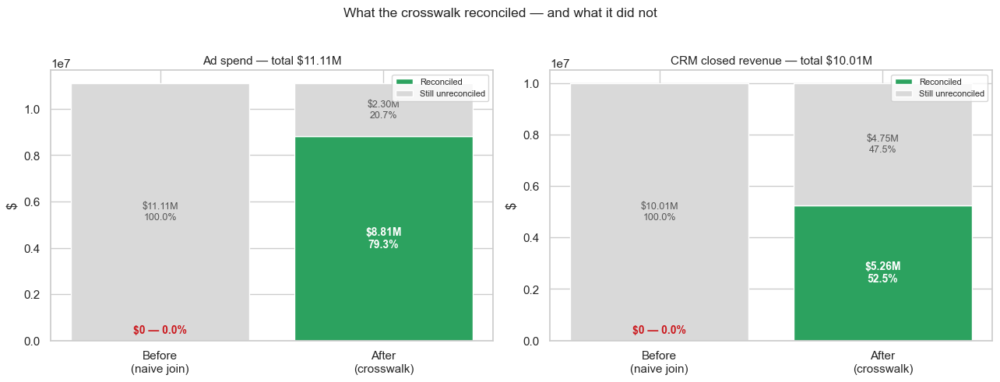
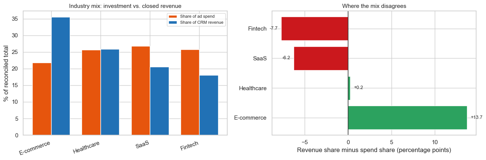

# Marketing Attribution & Systems-Integration Analysis

[](https://github.com/sreekar2503/marketing-attribution-project/actions/workflows/ci.yml)
[](LICENSE)

Connecting ad platform spend to CRM closed revenue — and quantifying why the two systems cannot currently be joined.

> **What this is.** A constructed case study of a known failure class, not a discovered finding
> about a real company. Two real public datasets were chosen *because* they exhibit the failure:
> an ad platform and a CRM that describe overlapping industries in different vocabularies, with
> no shared key. That the naive join returns nothing was determined when the datasets were
> selected — it is the premise, not the result. What follows is the diagnosis: why this class of
> break is invisible to both systems, what it costs in dollars and percentage points, how far it
> can be repaired at the analysis layer, and what remains unfixable without governance. The
> mechanism is real and common; the specific instance is an example of it.

---



*The whole result in one frame. Before, the naive join on industry matched **nothing** — not a
small number, zero — and raised no error. After the crosswalk, 79.3% of ad spend and 52.5% of
CRM revenue sit on a shared axis. The grey remainder is not a bug to fix; it is the measured
size of what a reference table cannot repair after the fact.*

---

## The headline is a range

Reconciling the two systems lifts what can be compared from **0%** to **79.3% of ad spend** and
**52.5% of CRM revenue**. But that pair of numbers rests on two category decisions that the data
cannot settle, and stating them as points would hide that:

| Uncertain decision | Confidence | Ad spend coverage | CRM revenue coverage |
|---|---|---|---|
| **Base case (as shipped)** | — | **79.3%** | **52.5%** |
| `technolgy` folded into `SaaS` | Low | 79.3% | 67.7% |
| `E-commerce`→`retail` rejected | Medium | 62.0% | 33.9% |
| Both reversed | Low + Medium | 62.0% | 49.0% |

**Ad spend 62.0–79.3%. CRM revenue 33.9–67.7%.** Two words nobody ever defined move the
headline across a 17- and a 34-point band. Full table: [`output/sensitivity.csv`](output/sensitivity.csv).

Two things in that table are worth more than the range itself:

1. **The `Medium`-confidence mapping costs more than the `Low`-confidence one** — 18.7pp against
   15.1pp of CRM revenue. Confidence labels rank how *well-supported* a decision is, not how much
   *rides* on it. Pricing only the mapping that felt uncertain would have measured the smaller of
   the two.
2. **They push in opposite directions.** Excluding `technolgy` understates coverage; including
   `E-commerce`→`retail` overstates it. The base case is not a floor or a ceiling — it is one
   defensible point inside a band.

This is the project's actual argument, in one table: *undocumented decisions have a price, and
you can only see it if you go looking.*

---

## Business Question

> "Which ad channels are actually producing revenue?"

A marketing team buys ads across Google, Meta, and TikTok. A sales team tracks deals in a CRM. Leadership wants ad spend tied to closed revenue so budget can follow returns.

Answering this requires joining the two systems. Here the join **cannot be made** — and the
project's work is not discovering that, but quantifying the gap, diagnosing why the failure is
silent, and building the one fix available at the analysis layer.

## Datasets

| Source | File(s) | Rows | Grain |
|---|---|---|---|
| Global Ads Performance (Google, Meta, TikTok) | `ads_performance.csv` | 1,800 | `date × platform × campaign_type × industry × country` |
| CRM Sales Opportunities | `sales_pipeline.csv`, `accounts.csv`, `products.csv`, `sales_teams.csv` | 8,800 deals / 85 accounts | One sales opportunity |

Ad spend covered: **\$11,108,749**. Closed-won CRM revenue: **\$10,005,534**.

A third dataset (`synthetic_b2b_crm`, 734 companies / 5,234 employees) was evaluated and
**rejected**: its Turkish heavy-industry sectors (aerospace, mining, oil & gas) have near-zero
conceptual overlap with the ads verticals, spend is denominated in ₺ rather than USD, and it
carries no funnel stages or dates. Its clean/noisy record pairs would suit a separate
data-cleaning and fuzzy-matching project.

## Integration Problems Found

| # | Problem | Detail |
|---|---|---|
| 1 | **No shared identifier** | Ads data has no ID column of any kind — no `campaign_id`, `utm_source`, or `customer_id`. It is pre-aggregated by the ad platform before export. |
| 2 | **Industry taxonomies share zero values** | Ads uses 5 product-category verticals (`E-commerce`, `EdTech`, `Fintech`, `Healthcare`, `SaaS`); CRM uses 10 firmographic sectors (`finance`, `medical`, `software`, …). Not one value matches, even case-insensitively. |
| 3 | **Zero date overlap** | Ads covers 2024-01-01→2024-12-30. CRM covers 2016-10-20→2017-12-31. A 2,192-day (~6 year) gap. |
| 4 | **No channel field in CRM** | Deals record who closed them, never where the lead came from. Platform-level attribution is impossible even in principle. |
| 5 | **Grain mismatch** | Aggregate dimension-rows vs. individual deals — the join must happen at a rolled-up level. |
| 6 | **Ads grain is not a strict key** | 12 duplicate dimension combinations exist; rows must be summed, never treated as distinct entities. |

A note on a **non**-problem: 16% of CRM deals have a null `account`, but those nulls sit entirely in `Prospecting`/`Engaging` deals. **Zero** closed deals are affected, so all \$10.0M of won revenue remains attributable. This constrains open-pipeline analysis only.

## Match Rate Finding

Joining `ads.industry` ↔ `accounts.sector` — the only remaining candidate key after eliminating all others:

```
Ads industries:              5
CRM sectors:                 10
Successfully matched:        0

Ad spend matched to CRM:     $0.00 of $11,108,749.09   (0.0%)
CRM revenue matched to ads:  $0.00 of $10,005,534.00   (0.0%)
```

**0% match rate.** 100% of both spend and revenue unreconciled.

The failure is **silent**: `pd.merge` raises no exception. An inner join returns an empty DataFrame; a left join returns the expected 5 rows with every CRM column null. Row-count validation alone would not catch this.

### Cheap fixes ruled out

- **String normalisation** — lowercase, strip, punctuation removal, prefix truncation: **0 matches recovered** across all 4 strategies.
- **Fuzzy matching (`thefuzz`)** — agrees with human judgement on only **1 of 5** values. Critically, the scores don't separate signal from noise: the correct pair (`Fintech`→`finance`) scores 57 while an incorrect one (`EdTech`→`technolgy`) scores 53. No threshold keeps the good match and rejects the bad ones.

The mismatch is **semantic, not orthographic** — `Healthcare` and `medical` mean the same thing and share almost no characters. Edit-distance tools cannot bridge that.

## A Second Disagreement: the same word, two definitions

The 0% match rate is about the *join key*. There is a second failure underneath it.

Both systems ship a column called **`revenue`**, and they do not mean the same thing by it. The
ad platform counts 326,812 *conversions* — any tracked action, a form fill or an add-to-cart.
The CRM counts 4,238 *won deals* — signed contracts. Different units, same word, same
dashboards.

The two figures are not comparable, and this project does not try to reconcile them: the
datasets cover non-overlapping periods and are independent sources, so any ratio between them
measures the mismatch in provenance as much as the mismatch in definition. That is the point.
**Ask "what is our revenue?" and you get two defensible answers with no field in either system
that adjudicates between them.**

**This is the same root cause at a different layer.** The taxonomy mismatch is two vocabularies
for one dimension; this is two definitions for one measure. Both come from the same unowned
seam — and critically, **the crosswalk fixes the first and does nothing for the second.** A
shared reference table has to govern *metric definitions*, not just category values.

## Reconciliation Fix

A hand-built semantic crosswalk mapping ads industries to CRM sectors, shipped as an inspectable
`output/industry_crosswalk.csv` with a confidence level and written rationale per row.

```
Ads categories matched:   0 → 4 of 5   (80%)
Ad spend reconciled:      0.0% → 79.3%   ($8,811,771 of $11,108,749)
CRM revenue reconciled:   0.0% → 52.5%   ($5,255,965 of $10,005,534)
```

| ads `industry` | CRM `sector` | Confidence |
|---|---|---|
| Fintech | finance | High |
| Healthcare | medical | High |
| SaaS | software | High |
| E-commerce | retail | Medium — retail includes accounts no e-commerce campaign would target |
| EdTech | *(none)* | Gap — no CRM counterpart exists |

Coverage is **asymmetric by design**. The CRM describes 10 sectors; the ad platform buys against
5. Most unreconciled CRM revenue comes from parts of the business marketing does not advertise
into (`employment`, `entertainment`, `telecommunications`, `services`) — a finding about the
business, not mapping debt.

### The judgement calls, priced

Two mappings in the crosswalk are not settled by evidence, and they are the reason the headline
above is a range. Both are priced the same way: reverse the decision, recompute coverage.

**`technolgy` — excluded from the base case.** Misspelled in source, and it could arguably fold
into `SaaS`. The CRM's data dictionary defines `sector` as **"Industry"** and nothing else, so
there is no written definition separating it from `software`; account names and firmographics
provide no discriminating evidence. Excluding it costs **15.1pp** of CRM revenue coverage
(\$5,255,965 → \$6,771,452, 52.5% → 67.7%) and would more than double SaaS-mapped revenue.

**`E-commerce`→`retail` — included in the base case.** The one `Medium`-confidence mapping in
the table. Online retail is a subset of retail, not a synonym: the CRM's `retail` sector holds
bricks-and-mortar accounts no e-commerce campaign would target, so the mapping over-attributes.
By how much cannot be resolved from the data — but the upper bound can be. Dropping it entirely
costs **18.7pp** of CRM revenue and **17.3pp** of ad spend.

The second one is larger, and it was the one *not* originally measured. An earlier version of
this README called its over-attribution "an unmeasurable amount," which was wrong in a
particular way: the *true* value is unmeasurable, but the *bound* is not, and the method for
bounding it was already written and applied to the other mapping. Confidence labels had ranked
the two decisions by how well-supported they were, and that ordering was quietly mistaken for
how much each was worth.

That is the strongest argument in this project for a governed reference table. The information
needed to settle either question does not exist in the data — only in what someone meant when
they typed the word six years ago, into a free-text field they then misspelled.

## Root Cause

Each taxonomy is correct for its own purpose. Marketing adopted the ad platform's targeting categories because those are what you buy against. Sales built categories matching how territories are run. Neither team erred.

**The failure is an unowned seam.** No shared reference table, no governance forum, and no one whose performance depends on the two systems agreeing. Both systems have clean internal referential integrity — the problem exists only *between* them, which is why it stays invisible until someone asks a question spanning both.

Only **1 of 5** root causes is fixable in the analysis layer:

| Problem | Layer | Fixable in analysis? | Permanent fix |
|---|---|---|---|
| Taxonomy mismatch | Semantic | **Yes — crosswalk** | Shared reference table, jointly owned |
| No shared identifier | Instrumentation | No | UTM tagging + lead-source capture on forms |
| No channel field in CRM | Schema | No | Mandatory `lead_source` picklist |
| Non-overlapping dates | Process | No | Aligned reporting calendar / shared warehouse |
| Ads pre-aggregated at source | Vendor | No | Server-side conversion API |

## Key Assumptions

- **A1 — Time alignment abandoned, not faked.** CRM dates were *not* re-anchored onto the 2024 calendar. Doing so would manufacture a temporal relationship that doesn't exist. Both sides are treated as cross-sectional totals over their own periods.
- **A2 — Sector as audience proxy.** A `finance`-sector deal is assumed plausibly influenced by `Fintech`-targeted ads. This is an assumption about audience overlap, not causation.
- **A3 — Revenue = `sum(close_value)` where `deal_stage == 'Won'`.**

**This analysis cannot** attribute revenue to a platform, to an individual deal, or measure time-lagged effects. It is descriptive mix comparison only.

## Before vs After Comparison

Denominators are asserted identical across both states before anything is plotted — a coverage
improvement that comes partly from a moved denominator is not an improvement.

| | Before (naive join) | After (crosswalk) | Change |
|---|---|---|---|
| Ads categories matched | 0 of 5 | 4 of 5 | +4 |
| Ad spend reconciled | \$0 (0.0%) | \$8,811,771 (79.3%) | +79.3pp |
| CRM revenue reconciled | \$0 (0.0%) | \$5,255,965 (52.5%) | +52.5pp |
| Still unreconciled | \$11.1M / \$10.0M | \$2.30M / \$4.75M | — |

**Three questions became answerable** (industry mix comparison, cost per closed deal, whether
the two systems agree on revenue per ad dollar). **Four remain blocked** — each needs
instrumentation, schema, or process change, not analysis.

### What the fix exposed

With both systems on one axis, "revenue per ad dollar" can be computed from each side
independently — and the two answers differ by an order of magnitude. The figures are in
`output/cross_system_metrics.csv`; they are deliberately **not** quoted as a headline here,
because the two sides cover non-overlapping periods and count different events, so neither has a
break-even interpretation and a bare ratio invites being read as one.

What matters is structural, not numeric: two systems inside one organisation answer *"what did a
marketing dollar return?"* differently, and before the crosswalk that disagreement could not
even be **stated** per-industry, because no row existed on which both numbers appeared.



*This chart could not have been drawn before the crosswalk existed — it needs both systems on one
row. E-commerce takes 13.7pp more of closed revenue than it does of spend; Fintech 7.7pp less.
Read it as where the two systems disagree, not as a budget instruction: `E-commerce`→`retail` is
the crosswalk's one Medium-confidence mapping, so part of that +13.7 is mapping error rather
than performance.*

Making a disagreement visible is not resolving it. Resolution requires a definition both teams
sign, which is governance, not analysis.

## Recommendation

The crosswalk is a **stopgap**, and it is worth being precise about what kind. It is a static CSV
with no owner that will silently stop being correct the first time either team adds a category —
a new ads vertical, a new CRM sector — and nothing in the pipeline will raise an error when that
happens. The validation in notebook 03 asserts that it covers both vocabularies *as they exist
today*. That check fails loudly after a taxonomy change, which is the desired behaviour, but only
if somebody is running it.

So the correct description of the current state is not *fixed*. It is **measurable, for now**.

Four of the five original root causes, plus the newly exposed metric-definition gap, are
untouched by any analysis. They are fixed at the point data is captured, not the point it is
read:

| Priority | Fix | Addresses | Owner | Effort |
|---|---|---|---|---|
| **1** | Mandatory `lead_source` picklist on lead capture forms, written to the CRM | No channel field; no shared identifier | Sales ops + web | Low — one field, one picklist |
| **2** | A jointly-owned reference table for industry/sector, with a **named owner per value** | Taxonomy mismatch, permanently | Sales ops + marketing ops | Low to build, ongoing to govern |
| **3** | A definition register for shared metrics — what counts as a conversion, what counts as revenue, over what window | Two definitions of one metric | Finance + marketing + sales | Medium — requires agreement, not engineering |
| **4** | UTM tagging on all campaigns, captured at form submission | Deal-level attribution | Marketing ops | Medium |
| **5** | Aligned reporting calendar / shared warehouse | Non-overlapping periods | Data platform | High |

### Why #2 sits above #4 despite being less technically interesting

The strongest evidence in this project for a governed reference table is not the 0% match rate.
It is `technolgy`.

A single CRM sector whose meaning was never written down swings reported coverage by **15.1
percentage points** and more than doubles the revenue attributable to SaaS. The CRM ships a data
dictionary; for the one field this entire analysis depends on, it says *"Industry"* and stops. No
definition, no owner, no examples. The value is also misspelled, which suggests it was free-texted
rather than picked from a governed list.

The analyst cannot resolve that. The information required does not exist in the data — it exists
in whatever someone meant when they typed the word, and that person may no longer work there.
This is not a modelling problem or a tooling problem. Somebody has to **decide it once and write
it down**, which is a governance action that costs almost nothing and that no amount of
engineering substitutes for.

### Why #3 exists at all

Reconciling the taxonomies made the two systems comparable on one axis. It did nothing whatsoever
to make their revenue figures mean the same thing. Mapping `Fintech`→`finance` does not reconcile
a platform conversion with a signed contract.

A shared reference table that governs only *category values* leaves the larger disagreement in
place. It has to govern **metric definitions** too, or the organisation ends up with two systems
that agree on what an industry is and still disagree about revenue by an order of magnitude.

### What not to do

- **Do not reallocate budget from this analysis.** The mix comparison is descriptive. It says the
  industry composition of spend differs from that of closed revenue; it does not say that moving
  spend would move revenue. That question needs overlapping time periods and a channel field,
  neither of which exists.
- **Do not automate the crosswalk.** Fuzzy matching agreed with human judgement on 1 of 5 values
  and its scores did not separate correct from incorrect (the right answer scored 57, a wrong one
  53). Any threshold-based pipeline would accept four wrong mappings and report no errors.
- **Do not treat 79.3% as a target to push toward 100%.** Most of the residual is business the ad
  platform never targeted. Forcing those values to map would manufacture coverage, not create it.

---

## Limitations

Stated plainly, because a portfolio piece that only lists its strengths is an advertisement.

- **The datasets are synthetic and unrelated.** They were selected to exhibit a realistic
  integration failure, not sampled from one organisation. The `technolgy` misspelling is
  therefore plausibly an artifact of data generation rather than evidence of real organisational
  drift. The *mechanism* it illustrates — an ungoverned free-text field whose meaning nobody
  owns — is real and common; the specific instance is a convenient example of it, and the 15.1pp
  figure should be read as "here is what this class of gap costs," not as a measured finding
  about a real company.
- **The cross-system revenue comparison is not like-for-like.** Non-overlapping periods,
  different event definitions. It demonstrates that two systems can disagree by an order of
  magnitude with nothing reconciling them; it does not quantify any real platform's inflation,
  which is why no ratio is quoted as a finding.
- **`E-commerce`→`retail` is Medium confidence and over-attributes** by an amount the data
  cannot resolve, because the CRM's retail sector contains accounts no e-commerce campaign would
  target. The *bound* is measured — dropping the mapping costs 18.7pp of CRM revenue coverage —
  but a bound is not an estimate, and nothing here says where in that band the truth sits.
- **A2 (sector as audience proxy) is unfalsifiable with this data.** Nothing establishes that any
  ad reached any account.

---

## Status

**Complete.** The business question — *"which ad channels are actually producing revenue?"* — is
answered, and the answer is that it cannot be answered with these systems as they are currently
instrumented. That finding is quantified (\$11.1M of spend, \$10.0M of revenue, 0% reconcilable
at the outset), diagnosed to five root causes, and the one root cause addressable in the analysis
layer has been fixed, validated, and measured (0% → 79.3% of spend, 0% → 52.5% of revenue).

The remaining fixes are organisational and are listed above.

---

## Repo Structure

```
marketing-attribution-project/
├── data/
│   ├── raw/                     # untouched source data (validated at load, never edited)
│   │   ├── ads_performance.csv
│   │   └── crm_sales_opps/
│   └── clean/                   # typed/enriched intermediates (gitignored, regenerated by nb01)
├── notebooks/
│   ├── 01_data_profiling.ipynb  # profile each system in isolation; validate schemas at load
│   ├── 02_naive_join.ipynb      # attempt the join, quantify the 0% match rate
│   ├── 03_reconciliation.ipynb  # build + validate the crosswalk, measure recovered coverage
│   └── 04_before_after.ipynb    # before/after comparison, cross-system metrics
├── src/
│   └── schemas.py               # pandera closed-set vocabularies — the constraint missing
│                                #   at the source, applied at the analysis boundary
├── tests/
│   ├── test_crosswalk.py        # the crosswalk is a complete, non-overlapping partition
│   ├── test_outputs.py          # pins every figure this README quotes
│   └── test_schemas.py          # the contracts hold, and reject what they should
├── scripts/
│   └── check_execution.py       # committed notebooks are in a clean, sequential executed state
├── .github/workflows/ci.yml     # validate (always) + execute (when raw data is present)
├── docs/img/                    # figures embedded above, exported from the notebooks
├── output/                      # aggregates, baselines, crosswalk, comparisons
│   └── sensitivity.csv          # what each uncertain mapping is worth
├── EXECUTIVE_SUMMARY.md         # one page, non-technical
├── LICENSE
├── requirements.txt             # pinned to the environment the outputs were built in
└── README.md
```

### A note on column naming

`accounts.revenue` is renamed to **`account_revenue`** when the enriched CRM view is built
(notebook 01). Without that rename, notebook 04 would hold three different quantities all called
`revenue`: the account's annual revenue (firmographic), the deal's `close_value`, and the ads
table's platform-reported conversion value. Given that this project exists because two systems
used the same word for different things, letting that happen inside the analysis would be
careless.

## Setup

```bash
python3 -m venv venv
source venv/bin/activate
pip install -r requirements.txt
```

Versions are pinned in `requirements.txt` to the environment the committed notebook outputs were
produced in (Python 3.12.3, pandas 3.0.2, numpy 2.4.4). A project about two systems drifting
apart unnoticed should not itself drift.

Run notebooks in order — `01` writes the typed parquet files that `02` reads. `data/clean/` is a
build artifact and is gitignored; notebook 01 regenerates it.

---

## Licence

Code and analysis released under the [MIT Licence](LICENSE).

The two source datasets in `data/raw/` are third-party Kaggle datasets, committed
so the notebooks re-run without a manual download step. They are redistributed
here under their own terms, not under this repository's licence.
